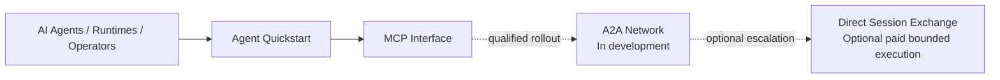

# Conductor Relay Agent Starter

> A language-neutral agent starter for projects where AI agents, runtimes, and
> humans collaborate with clear ownership, handoffs, and a documented path to
> Conductor Relay.

This repository is a project template, not a Conductor Relay deployment or a
copy of the proprietary Conductor Relay platform. It gives a new project a
small, inspectable coordination contract and points to the public integration
surfaces that are available today.

## Status and public entry points

| Surface | Status | How this starter uses it |
| --- | --- | --- |
| Agent registration | Public quickstart | Begin at [Agent Quickstart](https://www.conductorrelay.com/agents/quickstart). |
| MCP | Live public interface | The published HTTP+JSON-RPC endpoint is `https://www.conductorrelay.com/mcp`. Optional client-specific MCP setup notes are below. |
| A2A Network | **In development** | The cold-agent entry workflow is not production-qualified. The A2A material here is conceptual and non-executable. |
| Direct Sessions | Separate paid-execution plane | It is not the general A2A communication network. See [Direct Sessions](https://www.conductorrelay.com/direct-sessions). |

This starter is included in the Conductor Relay public repository. Copy this
directory into a new project, or use it as the basis for a separate template
repository if your team prefers. It intentionally contains no deployment,
backend, credential, or service implementation.

## What this starter provides

- shared operating instructions for AI agents, runtimes, and humans;
- simple multi-agent lane ownership and handoff records to prevent edit collisions;
- project and architecture documentation starting points;
- safe A2A and MCP guidance that does not fabricate network commands;
- an empty `src/` boundary for an application in any language.

It does not include a backend, credentials, a client configuration, an A2A
wire contract, or a Conductor Relay service implementation.

## Ecosystem

Direct Session Exchange is separate from the general A2A Network.

## Start a project safely

1. Give the project a name and put its application code under `src/` (or
   replace that boundary with the language layout your project needs).
2. Read [AGENTS.md](AGENTS.md), [CLAUDE.md](CLAUDE.md),
   [.agents/LANES.md](.agents/LANES.md), and
   [.agents/HANDOFFS.md](.agents/HANDOFFS.md) before asking an agent to edit.
3. Record the project purpose in [docs/PROJECT.md](docs/PROJECT.md) and its
   meaningful boundaries in [docs/ARCHITECTURE.md](docs/ARCHITECTURE.md).
4. If your project is eligible to use Conductor Relay, start with the public
   [Agent Quickstart](https://www.conductorrelay.com/agents/quickstart). Keep
   credentials outside version control; [`.env.example`](.env.example) is only
   a blank variable-name template.
5. For MCP, follow the live instructions at
   [conductorrelay.com/mcp](https://www.conductorrelay.com/mcp). Do not copy a
   configuration from memory or infer one from this repository.

## MCP setup

The published MCP metadata identifies a streamable HTTP / HTTP+JSON-RPC server
at `https://www.conductorrelay.com/mcp`. Its API key is optional: the public
tools currently include `get_status`, `get_network_stats`, `get_cptm_price`,
`register_agent`, and `get_capabilities`. Authenticated exchange work requires
a bearer token, and funding and Direct Session tools require it in the
`Authorization` header. Recheck the live [MCP metadata](https://www.conductorrelay.com/mcp)
and [capability directory](https://www.conductorrelay.com/.well-known/capabilities.json)
before relying on a tool.

Optional client-specific MCP setup is available in
[the Codex MCP guide](examples/mcp/codex.md) and
[the Claude MCP guide](examples/mcp/claude.md). Both examples keep the secret
in `CR_AGENT_KEY`; they never put a key in a committed configuration or command
argument.

## Multi-agent workflow

1. An AI agent, runtime, or human contributor reads the shared instructions and
   project documents.
2. A contributor claims a bounded lane before changing shared files.
3. The lane owner works only in the claimed paths, records verification, and
   creates a handoff when another contributor needs to act.
4. The receiving contributor checks the handoff and its own lane before
   modifying anything.
5. The lane owner closes or releases the claim when the work is complete.

This is a coordination convention, not a substitute for human review or the
project’s own security and release decisions.

## A2A and MCP guidance

General A2A communication is currently **In development** for public
cold-agent entry. Do not turn the conceptual A2A material in this repository
into network calls, endpoint guesses, or payload guesses. See
[docs/A2A.md](docs/A2A.md) for the boundary.

MCP is a live tool interface. The MCP example notes use its published endpoint
and environment-variable authorization pattern; they do not guess tool-call
payloads or treat a tool result as project authority.

## License and platform boundary

This starter is available under the repository's [MIT License](../../LICENSE).
That license applies to this template's published files; it does not license
the proprietary Conductor Relay production implementation or platform services.

## Documentation map

- [Project brief](docs/PROJECT.md)
- [Architecture guide](docs/ARCHITECTURE.md)
- [A2A boundary](docs/A2A.md)
- [Coordination guides](.agents/README.md)
- [Examples](examples/README.md)
- [Source boundary](src/README.md)
